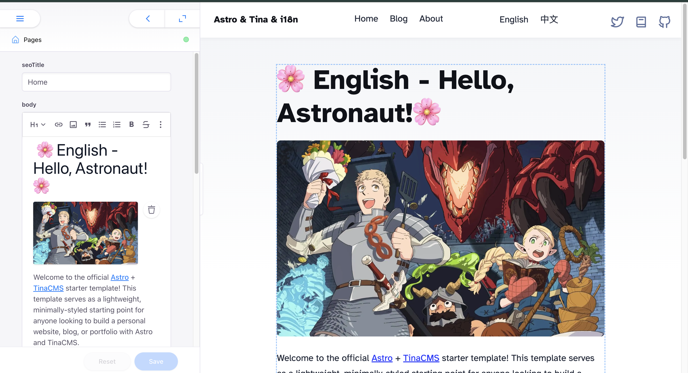

# Astro + TinaCMS + i18n Starter

This is a starter project integrated with [Astro](https://docs.astro.build/en/guides/cms/tina-cms/), [TinaCMS](https://tina.io/docs/frameworks/astro), [TinaCloud](https://tina.io/docs/tina-cloud), and [i18n](https://docs.astro.build/en/guides/internationalization/).  

The project is built based on [tina-astro-starter](https://github.com/tinacms/tina-astro-starter#) and extends it with multilingual support, customized routing, and full TypeScript support for type-safe development.



## Features

- 🌐 **Multilingual Support (i18n)** — Organize content by locale with dynamic routing.
- 📝 **Headless CMS with TinaCMS** — Visual editing with Git-based content management.
- ⚡ **Astro Framework** — Static site generation with modern frontend tooling.
- ☁️ **TinaCloud Integration** — Ready to connect to TinaCloud for real-time content editing.

## File Directory

### Content Structure

Multilingual content is stored in the `src/content` folder, with subfolders for each language code (e.g., `en`, `zh-TW`):

```text
src/content
├── blog
│   ├── en
│   │   ├── first-post.mdx
│   │   └── second-post.mdx
│   └── zh-TW
│       ├── first-post.mdx
│       └── second-post.mdx
├── config
│   └── config.json
└── page
    ├── en
    │   ├── about.mdx
    │   └── home.mdx
    └── zh-TW
        ├── about.mdx
        └── home.mdx
```

### Routing Structure

Routes are defined dynamically in the `src/pages` folder to support internationalization and clean URLs:

```text
src/pages
├── [...locale]
│   ├── [...slug].astro       // Generic page routing per locale
│   ├── blog
│   │   ├── [...slug].astro   // Blog post routing per locale
│   │   └── index.astro       // Blog index per locale
│   └── index.astro           // Home page per locale
├── [...slug].astro           // Fallback for non-localized pages
├── blog
│   ├── [...slug].astro       // Default blog routing
│   └── index.astro           // Default blog index
├── index.astro               // Default homepage
└── rss.xml.js                // RSS feed
```

## Getting Started

1. **Install dependencies:**

   ```bash
   npm install
   ```

2. **Start the development server:**

   ```bash
   npm run dev
   ```

3. **Open TinaCMS:**

   Navigate to `http://localhost:4321/admin/index.html` to access the CMS interface.


